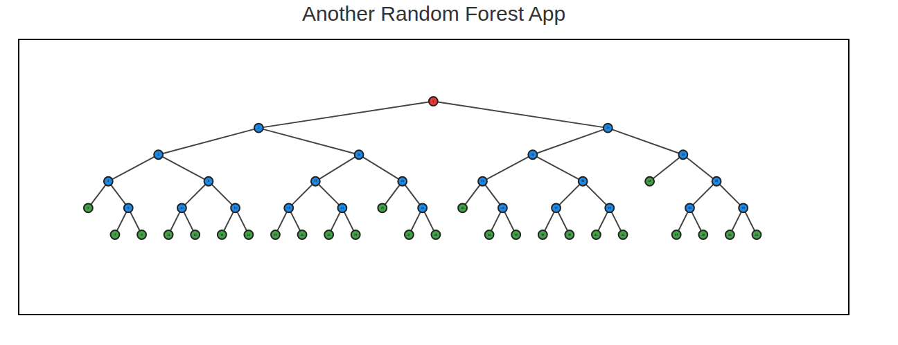

# Zufällige Wälder — Random Forests in R

**Course project** · Programmiersprache R · Gruppe 7  
Yousef Khell, Paul Proft, Teodor Ticu

---

## About

An implementation of the **Random Forest** algorithm in R, built on top of
CART (Classification and Regression Trees). Includes a UI for interactively
visualizing the generated trees.

The implementation follows the theory presented in *Richter*.  
Documentation is available under `man/`.

## Examples

## Documentation

Full documentation lives in [`man/`](man/).jj
